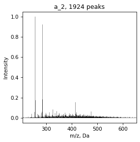

# Batch Processing


```python
from natorgms.spectrum import Spectrum
from natorgms.spectra import SpectrumList
import natorgms.draw as draw
import pandas as pd
import matplotlib.pyplot as plt
import os
```

## Load spectra

We can load separate Spectrum, treat them and then join it in SpectrumList object which is a list of spectra 


```python
specs = SpectrumList()
for filename in sorted(os.listdir("data/similarity/")):
    if filename[-3:] != 'csv':
        continue
    spec = Spectrum.read_csv(f"data/similarity/{filename}", assign_mark=True)
    specs.append(spec)

specs.get_names()
```


    ['a_1', 'a_2', 'a_3', 'a_4', 'a_5', 'a_6']


Or directly load from folder if specs already treated 


```python
specs = SpectrumList.read_csv('data/similarity/')
specs.get_names()
```


    ['a_4', 'a_5', 'a_6', 'a_2', 'a_3', 'a_1']


## Calculate simmilarity index and plot matrix

Calculate simmilarity indexes. For now it common indexes - Cosine, Tanimoto and Jaccard


```python
specs.get_simmilarity(mode='cosine')
```


    array([[1.        , 0.63921734, 0.55387418, 0.22893115, 0.12221844,
            0.24206235],
           [0.63921734, 1.        , 0.46713676, 0.11426236, 0.04536192,
            0.13553428],
           [0.55387418, 0.46713676, 1.        , 0.3297159 , 0.12996979,
            0.33440804],
           [0.22893115, 0.11426236, 0.3297159 , 1.        , 0.27330141,
            0.59910651],
           [0.12221844, 0.04536192, 0.12996979, 0.27330141, 1.        ,
            0.0912144 ],
           [0.24206235, 0.13553428, 0.33440804, 0.59910651, 0.0912144 ,
            1.        ]])


And plot matrix


```python
specs.draw_simmilarity(mode='cosine')
```


    

    


## Calculate metrics

From spectra we can get molecular metrics


```python
specs.get_mol_metrics()
```


<div>
<style scoped>
    .dataframe tbody tr th:only-of-type {
        vertical-align: middle;
    }

    .dataframe tbody tr th {
        vertical-align: top;
    }

    .dataframe thead th {
        text-align: right;
    }
</style>
<table border="1" class="dataframe">
  <thead>
    <tr style="text-align: right;">
      <th></th>
      <th>a_4</th>
      <th>a_5</th>
      <th>a_6</th>
      <th>a_2</th>
      <th>a_3</th>
      <th>a_1</th>
    </tr>
  </thead>
  <tbody>
    <tr>
      <th>AI</th>
      <td>-0.079344</td>
      <td>-0.037731</td>
      <td>-0.307631</td>
      <td>0.444909</td>
      <td>0.613860</td>
      <td>0.171642</td>
    </tr>
    <tr>
      <th>C</th>
      <td>21.476279</td>
      <td>21.143970</td>
      <td>17.786572</td>
      <td>22.186035</td>
      <td>23.129087</td>
      <td>17.967260</td>
    </tr>
    <tr>
      <th>CAI</th>
      <td>9.251700</td>
      <td>8.712936</td>
      <td>9.954005</td>
      <td>15.300819</td>
      <td>16.397214</td>
      <td>12.064931</td>
    </tr>
    <tr>
      <th>CRAM</th>
      <td>0.552194</td>
      <td>0.540266</td>
      <td>0.485958</td>
      <td>0.090364</td>
      <td>0.035393</td>
      <td>0.204550</td>
    </tr>
    <tr>
      <th>DBE</th>
      <td>12.644497</td>
      <td>12.636119</td>
      <td>8.106037</td>
      <td>13.660797</td>
      <td>16.722827</td>
      <td>8.526630</td>
    </tr>
    <tr>
      <th>DBE-O</th>
      <td>0.806469</td>
      <td>0.492241</td>
      <td>0.560464</td>
      <td>7.055005</td>
      <td>10.396550</td>
      <td>2.820194</td>
    </tr>
    <tr>
      <th>DBE-OC</th>
      <td>0.033105</td>
      <td>0.017236</td>
      <td>0.017788</td>
      <td>0.298224</td>
      <td>0.447654</td>
      <td>0.118010</td>
    </tr>
    <tr>
      <th>DBE_AI</th>
      <td>0.419919</td>
      <td>0.205085</td>
      <td>0.273470</td>
      <td>6.775581</td>
      <td>9.990954</td>
      <td>2.624301</td>
    </tr>
    <tr>
      <th>H</th>
      <td>20.004788</td>
      <td>19.264393</td>
      <td>21.578437</td>
      <td>19.305284</td>
      <td>15.211308</td>
      <td>21.029147</td>
    </tr>
    <tr>
      <th>H/C</th>
      <td>0.941654</td>
      <td>0.924041</td>
      <td>1.220249</td>
      <td>0.918817</td>
      <td>0.655002</td>
      <td>1.261374</td>
    </tr>
    <tr>
      <th>N</th>
      <td>0.341225</td>
      <td>0.248690</td>
      <td>0.217368</td>
      <td>0.254807</td>
      <td>0.398788</td>
      <td>0.147887</td>
    </tr>
    <tr>
      <th>NOSC</th>
      <td>0.225485</td>
      <td>0.268255</td>
      <td>-0.290940</td>
      <td>-0.289653</td>
      <td>-0.039698</td>
      <td>-0.601656</td>
    </tr>
    <tr>
      <th>O</th>
      <td>11.838028</td>
      <td>12.143877</td>
      <td>7.545574</td>
      <td>6.605792</td>
      <td>6.326276</td>
      <td>5.706435</td>
    </tr>
    <tr>
      <th>O/C</th>
      <td>0.555214</td>
      <td>0.575824</td>
      <td>0.439298</td>
      <td>0.295497</td>
      <td>0.279618</td>
      <td>0.315787</td>
    </tr>
    <tr>
      <th>S</th>
      <td>0.045326</td>
      <td>0.038467</td>
      <td>0.069625</td>
      <td>0.024617</td>
      <td>0.006808</td>
      <td>0.048007</td>
    </tr>
    <tr>
      <th>Unnamed: 0</th>
      <td>5134.428335</td>
      <td>1918.021934</td>
      <td>1496.312157</td>
      <td>841.325051</td>
      <td>1782.231948</td>
      <td>1584.499424</td>
    </tr>
    <tr>
      <th>errorPPM</th>
      <td>0.001824</td>
      <td>0.029912</td>
      <td>0.045206</td>
      <td>-0.029267</td>
      <td>-0.030579</td>
      <td>0.000557</td>
    </tr>
    <tr>
      <th>formula</th>
      <td>NaN</td>
      <td>NaN</td>
      <td>NaN</td>
      <td>NaN</td>
      <td>NaN</td>
      <td>NaN</td>
    </tr>
    <tr>
      <th>mass</th>
      <td>473.590881</td>
      <td>472.240469</td>
      <td>361.207872</td>
      <td>395.774294</td>
      <td>399.951346</td>
      <td>331.795644</td>
    </tr>
    <tr>
      <th>peakNo</th>
      <td>5134.428335</td>
      <td>1918.021934</td>
      <td>1496.312157</td>
      <td>841.325051</td>
      <td>1782.231948</td>
      <td>1584.499424</td>
    </tr>
    <tr>
      <th>z</th>
      <td>0.000000</td>
      <td>0.000000</td>
      <td>0.000000</td>
      <td>0.000000</td>
      <td>0.000000</td>
      <td>0.000000</td>
    </tr>
  </tbody>
</table>
</div>


Get molecular class density and plot bar


```python
specs.draw_mol_density()
specs.get_mol_density()
```


<div>
<style scoped>
    .dataframe tbody tr th:only-of-type {
        vertical-align: middle;
    }

    .dataframe tbody tr th {
        vertical-align: top;
    }

    .dataframe thead th {
        text-align: right;
    }
</style>
<table border="1" class="dataframe">
  <thead>
    <tr style="text-align: right;">
      <th></th>
      <th>a_4</th>
      <th>a_5</th>
      <th>a_6</th>
      <th>a_2</th>
      <th>a_3</th>
      <th>a_1</th>
    </tr>
  </thead>
  <tbody>
    <tr>
      <th>unsat_lowOC</th>
      <td>0.201447</td>
      <td>0.183535</td>
      <td>0.408356</td>
      <td>0.195555</td>
      <td>0.147491</td>
      <td>0.196795</td>
    </tr>
    <tr>
      <th>unsat_highOC</th>
      <td>0.654447</td>
      <td>0.716404</td>
      <td>0.217642</td>
      <td>0.006134</td>
      <td>0.004349</td>
      <td>0.080142</td>
    </tr>
    <tr>
      <th>condensed_lowOC</th>
      <td>0.026479</td>
      <td>0.005946</td>
      <td>0.028384</td>
      <td>0.256306</td>
      <td>0.441213</td>
      <td>0.118184</td>
    </tr>
    <tr>
      <th>condensed_highOC</th>
      <td>0.002802</td>
      <td>0.000989</td>
      <td>0.000662</td>
      <td>0.001651</td>
      <td>0.002156</td>
      <td>0.002919</td>
    </tr>
    <tr>
      <th>aromatic_lowOC</th>
      <td>0.028453</td>
      <td>0.013982</td>
      <td>0.044924</td>
      <td>0.290728</td>
      <td>0.336764</td>
      <td>0.138210</td>
    </tr>
    <tr>
      <th>aromatic_highOC</th>
      <td>0.015343</td>
      <td>0.011668</td>
      <td>0.005026</td>
      <td>0.014576</td>
      <td>0.014677</td>
      <td>0.016288</td>
    </tr>
    <tr>
      <th>aliphatics</th>
      <td>0.014729</td>
      <td>0.023744</td>
      <td>0.155616</td>
      <td>0.005297</td>
      <td>0.000097</td>
      <td>0.045678</td>
    </tr>
    <tr>
      <th>lipids</th>
      <td>0.028270</td>
      <td>0.022411</td>
      <td>0.101287</td>
      <td>0.186821</td>
      <td>0.018383</td>
      <td>0.369506</td>
    </tr>
    <tr>
      <th>N-satureted</th>
      <td>0.003950</td>
      <td>0.000688</td>
      <td>0.016474</td>
      <td>0.005117</td>
      <td>0.000000</td>
      <td>0.006827</td>
    </tr>
    <tr>
      <th>undefinded</th>
      <td>0.024080</td>
      <td>0.020633</td>
      <td>0.021629</td>
      <td>0.037814</td>
      <td>0.034871</td>
      <td>0.025451</td>
    </tr>
  </tbody>
</table>
</div>


    

    


Also we can calculate density of squares of Van Krevelen diagram


```python
specs.get_square_vk()
```


<div>
<style scoped>
    .dataframe tbody tr th:only-of-type {
        vertical-align: middle;
    }

    .dataframe tbody tr th {
        vertical-align: top;
    }

    .dataframe thead th {
        text-align: right;
    }
</style>
<table border="1" class="dataframe">
  <thead>
    <tr style="text-align: right;">
      <th></th>
      <th>a_4</th>
      <th>a_5</th>
      <th>a_6</th>
      <th>a_2</th>
      <th>a_3</th>
      <th>a_1</th>
    </tr>
  </thead>
  <tbody>
    <tr>
      <th>1</th>
      <td>0.008942</td>
      <td>0.004066</td>
      <td>0.014149</td>
      <td>0.046670</td>
      <td>0.178541</td>
      <td>0.009918</td>
    </tr>
    <tr>
      <th>2</th>
      <td>0.002034</td>
      <td>0.001793</td>
      <td>0.012627</td>
      <td>0.033494</td>
      <td>0.149713</td>
      <td>0.005776</td>
    </tr>
    <tr>
      <th>3</th>
      <td>0.000819</td>
      <td>0.000160</td>
      <td>0.010486</td>
      <td>0.046734</td>
      <td>0.061893</td>
      <td>0.010208</td>
    </tr>
    <tr>
      <th>4</th>
      <td>0.023089</td>
      <td>0.017808</td>
      <td>0.038597</td>
      <td>0.041165</td>
      <td>0.023237</td>
      <td>0.069177</td>
    </tr>
    <tr>
      <th>5</th>
      <td>0.005045</td>
      <td>0.003707</td>
      <td>0.044065</td>
      <td>0.153976</td>
      <td>0.004767</td>
      <td>0.293159</td>
    </tr>
    <tr>
      <th>6</th>
      <td>0.028251</td>
      <td>0.009248</td>
      <td>0.023760</td>
      <td>0.356841</td>
      <td>0.348926</td>
      <td>0.188009</td>
    </tr>
    <tr>
      <th>7</th>
      <td>0.070833</td>
      <td>0.049838</td>
      <td>0.102810</td>
      <td>0.199036</td>
      <td>0.165541</td>
      <td>0.093670</td>
    </tr>
    <tr>
      <th>8</th>
      <td>0.087435</td>
      <td>0.083649</td>
      <td>0.225485</td>
      <td>0.060352</td>
      <td>0.023909</td>
      <td>0.103503</td>
    </tr>
    <tr>
      <th>9</th>
      <td>0.015644</td>
      <td>0.021632</td>
      <td>0.129569</td>
      <td>0.008620</td>
      <td>0.001865</td>
      <td>0.045593</td>
    </tr>
    <tr>
      <th>10</th>
      <td>0.002791</td>
      <td>0.006214</td>
      <td>0.034856</td>
      <td>0.006054</td>
      <td>0.000000</td>
      <td>0.027571</td>
    </tr>
    <tr>
      <th>11</th>
      <td>0.066727</td>
      <td>0.092062</td>
      <td>0.017016</td>
      <td>0.035408</td>
      <td>0.032921</td>
      <td>0.039697</td>
    </tr>
    <tr>
      <th>12</th>
      <td>0.372026</td>
      <td>0.420460</td>
      <td>0.109793</td>
      <td>0.010715</td>
      <td>0.008141</td>
      <td>0.040661</td>
    </tr>
    <tr>
      <th>13</th>
      <td>0.248249</td>
      <td>0.219455</td>
      <td>0.138720</td>
      <td>0.000269</td>
      <td>0.000090</td>
      <td>0.048610</td>
    </tr>
    <tr>
      <th>14</th>
      <td>0.015856</td>
      <td>0.013362</td>
      <td>0.040365</td>
      <td>0.000000</td>
      <td>0.000000</td>
      <td>0.011880</td>
    </tr>
    <tr>
      <th>15</th>
      <td>0.000423</td>
      <td>0.001304</td>
      <td>0.005874</td>
      <td>0.000000</td>
      <td>0.000000</td>
      <td>0.001774</td>
    </tr>
    <tr>
      <th>16</th>
      <td>0.003531</td>
      <td>0.008137</td>
      <td>0.001184</td>
      <td>0.000000</td>
      <td>0.000211</td>
      <td>0.002251</td>
    </tr>
    <tr>
      <th>17</th>
      <td>0.028628</td>
      <td>0.036910</td>
      <td>0.005151</td>
      <td>0.000182</td>
      <td>0.000000</td>
      <td>0.003421</td>
    </tr>
    <tr>
      <th>18</th>
      <td>0.015810</td>
      <td>0.010031</td>
      <td>0.004591</td>
      <td>0.000237</td>
      <td>0.000123</td>
      <td>0.003076</td>
    </tr>
    <tr>
      <th>19</th>
      <td>0.002573</td>
      <td>0.000165</td>
      <td>0.024572</td>
      <td>0.000249</td>
      <td>0.000000</td>
      <td>0.001212</td>
    </tr>
    <tr>
      <th>20</th>
      <td>0.000423</td>
      <td>0.000000</td>
      <td>0.008698</td>
      <td>0.000000</td>
      <td>0.000000</td>
      <td>0.000089</td>
    </tr>
  </tbody>
</table>
</div>


## SpectrumList is a list

With SpectrumList object we can work as with list, for example, plot spectrum


```python
for spec in specs:
    draw.spectrum(spec)
```


    

    


    

    


    

    


    

    


    

    


    

    


And save all data in folder


```python
if 'temp' not in os.listdir():
    os.mkdir('temp')

specs.to_csv('temp')
```
