# Compare two spectrum


```python
import nhsmass.draw as draw
from nhsmass.spectrum import Spectrum
from nhsmass.spectra import SpectrumList
import pandas as pd
import numpy as np
import matplotlib.pyplot as plt
```

## Load and plot

Load and assign spectrum. Than drop unassigned masses and normilize by sum of intensity


```python
spec1 = Spectrum.read_csv("data/sample1.csv",
                            mapper = {"mw": "mass", "relativeAbundance": 'intensity'},
                            sep=',',
                            ignore_columns=["peakNo", "errorPPM",'formula', "DBE", "class", "z"],
                           )
spec1 = spec1.assign(brutto_dict={'C':(4,41),'H':(4,81),'O':(0,26),'N':(0,4)})
spec1 = spec1.drop_unassigned().normalize()

spec2 = Spectrum.read_csv("data/sample2.txt").assign(brutto_dict={'C':(4,41),'H':(4,81),'O':(0,26),'N':(0,4)})
spec2 = spec2.drop_unassigned().normalize()
```

Plot two spectra


```python
fig, ax = plt.subplots(figsize=(4,4), dpi=75)
draw.spectrum(spec2, color='red', alpha=0.5, ax=ax)
draw.spectrum(spec1, color='blue', alpha=0.5, ax=ax)
```


    
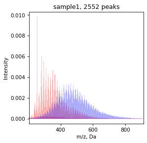
    


calculate metrics and Van Krevelen diagram


```python
spec1 = spec1.calc_all_metrics()
spec2 = spec2.calc_all_metrics()

fig, ax = plt.subplots(figsize=(14,4),ncols=3, dpi=75)
draw.vk(spec2, color='red', ax=ax[0], title='')
draw.vk(spec1, color='blue', ax=ax[1], title='')
draw.vk(spec2, color='red', ax=ax[2], title='')
draw.vk(spec1, color='blue', ax=ax[2], title='')
ax[0].set_title('spec2')
ax[1].set_title('spec1')
ax[2].set_title('spec2, spec1')
```


    Text(0.5, 1.0, 'spec2, spec1')


    
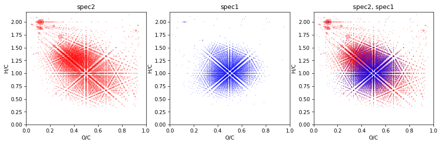
    


## Boolean operations

Calculate and draw sum of spectrum


```python
spec3 = spec1 + spec2 #'spec1 | spec2' - same

fig, ax = plt.subplots(figsize=(14,4),ncols=3, dpi=75)
draw.vk(spec2, color='red', ax=ax[0], title='')
draw.vk(spec1, color='blue', ax=ax[1], title='')
draw.vk(spec3, color='green', ax=ax[2], title='')
ax[0].set_title('spec2')
ax[1].set_title('spec1')
ax[2].set_title('spec2 + spec1')
```


    Text(0.5, 1.0, 'spec2 + spec1')


    
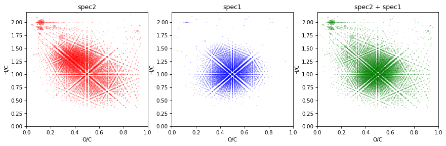
    


Calculate and draw substrate spec1 from spec2


```python
spec3 = spec2 - spec1

fig, ax = plt.subplots(figsize=(14,4),ncols=3, dpi=75)
draw.vk(spec2, color='red', ax=ax[0], title='')
draw.vk(spec1, color='blue', ax=ax[1], title='')
draw.vk(spec3, color='green', ax=ax[2], title='')
ax[0].set_title('spec2')
ax[1].set_title('spec1')
ax[2].set_title('spec2 - spec1')
```


    Text(0.5, 1.0, 'spec2 - spec1')


    
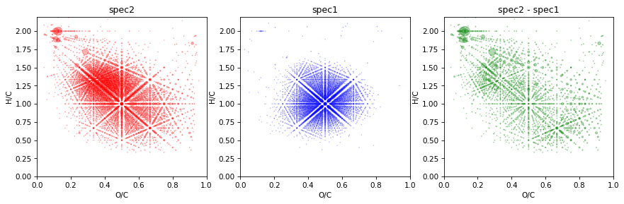
    


Also we can look for spec prepared by substraction by intensity


```python
spec3 = spec2.intens_sub(spec1)

fig, ax = plt.subplots(figsize=(14,4),ncols=3, dpi=75)
draw.vk(spec2, color='red', ax=ax[0], title='')
draw.vk(spec1, color='blue', ax=ax[1], title='')
draw.vk(spec3, color='green', ax=ax[2], title='')
ax[0].set_title('spec2')
ax[1].set_title('spec1')
ax[2].set_title('spec2 - spec1')
```


    Text(0.5, 1.0, 'spec2 - spec1')


    
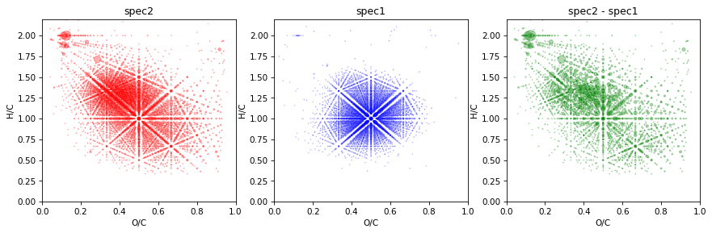
    


Calculate and draw common of spec1 and spec2


```python
spec3 = spec1 & spec2

fig, ax = plt.subplots(figsize=(14,4),ncols=3, dpi=75)
draw.vk(spec2, color='red', ax=ax[0], title='')
draw.vk(spec1, color='blue', ax=ax[1], title='')
draw.vk(spec3, color='green', ax=ax[2], title='')
ax[0].set_title('spec2')
ax[1].set_title('spec1')
ax[2].set_title('spec2 & spec1')
```


    Text(0.5, 1.0, 'spec2 & spec1')


    
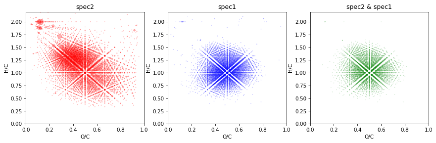
    


Calculate and draw symmetric difference of spec1 and spec2


```python
spec3 = spec1 ^ spec2

fig, ax = plt.subplots(figsize=(14,4),ncols=3, dpi=75)
draw.vk(spec2, color='red', ax=ax[0], title='')
draw.vk(spec1, color='blue', ax=ax[1], title='')
draw.vk(spec3, color='green', ax=ax[2], title='')
ax[0].set_title('spec2')
ax[1].set_title('spec1')
ax[2].set_title('spec2 ^ spec1')
```


    Text(0.5, 1.0, 'spec2 ^ spec1')


    
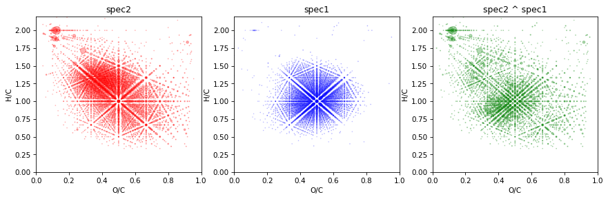
    


## Simmilarity

Calculate simmilarity indexes. For now it common indexes - Cosine, Tanimoto and Jaccard


```python
for index in ['cosine', 'tanimoto', 'jaccard']:
    value = spec1.simmilarity(spec2, mode=index)
    print(f'{index}: {round(value,3)} ')
```

    cosine: 0.381 
    tanimoto: 0.233 
    jaccard: 0.362 


You can plot venn diagram for two ore three spectrum


```python
draw.venn(spec1, spec2)
```


    
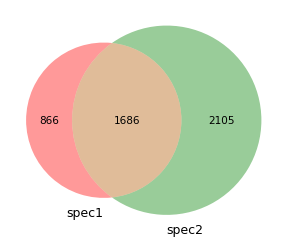
    


## Calculate metrics

Calculate molecular class zones and get density. For plot we can use SpectrumList class from nhsmass.spectra


```python
specs = SpectrumList([spec1, spec2])
specs.draw_mol_density()
```


    
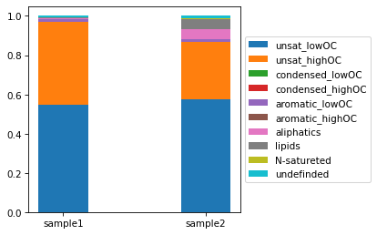
    


Calculate DBE vs nO


```python
fig, ax = plt.subplots(figsize=(4,4), dpi=75)
spec1.get_dbe_vs_o(olim=(5,17), ax=ax, color='blue')
spec2.get_dbe_vs_o(olim=(5,17), ax=ax, color='red')
```


    (0.7450505598639487, 2.425647197353448)


    
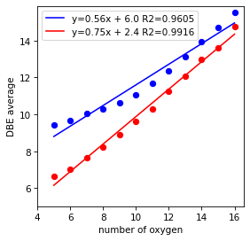
    


Also we can compare metrics


```python
specs.get_mol_metrics()
```


<div>
<style scoped>
    .dataframe tbody tr th:only-of-type {
        vertical-align: middle;
    }

    .dataframe tbody tr th {
        vertical-align: top;
    }

    .dataframe thead th {
        text-align: right;
    }
</style>
<table border="1" class="dataframe">
  <thead>
    <tr style="text-align: right;">
      <th></th>
      <th>sample1</th>
      <th>sample2</th>
    </tr>
  </thead>
  <tbody>
    <tr>
      <th>AI</th>
      <td>0.009488</td>
      <td>-0.070687</td>
    </tr>
    <tr>
      <th>C</th>
      <td>24.073906</td>
      <td>18.514470</td>
    </tr>
    <tr>
      <th>CAI</th>
      <td>12.290746</td>
      <td>10.215714</td>
    </tr>
    <tr>
      <th>CRAM</th>
      <td>0.811543</td>
      <td>0.689125</td>
    </tr>
    <tr>
      <th>DBE</th>
      <td>12.464717</td>
      <td>8.424983</td>
    </tr>
    <tr>
      <th>DBE-O</th>
      <td>0.681662</td>
      <td>0.206055</td>
    </tr>
    <tr>
      <th>DBE-OC</th>
      <td>0.024155</td>
      <td>0.005604</td>
    </tr>
    <tr>
      <th>DBE_AI</th>
      <td>0.681557</td>
      <td>0.126226</td>
    </tr>
    <tr>
      <th>H</th>
      <td>25.218483</td>
      <td>22.258804</td>
    </tr>
    <tr>
      <th>H/C</th>
      <td>1.051983</td>
      <td>1.201142</td>
    </tr>
    <tr>
      <th>N</th>
      <td>0.000105</td>
      <td>0.079829</td>
    </tr>
    <tr>
      <th>NOSC</th>
      <td>-0.065208</td>
      <td>-0.278672</td>
    </tr>
    <tr>
      <th>O</th>
      <td>11.783056</td>
      <td>8.218927</td>
    </tr>
    <tr>
      <th>O/C</th>
      <td>0.493383</td>
      <td>0.453804</td>
    </tr>
    <tr>
      <th>mass</th>
      <td>501.765864</td>
      <td>376.178194</td>
    </tr>
  </tbody>
</table>
</div>


And van krevelen square density


```python
fig, ax = plt.subplots(figsize=(11,4), ncols=2, dpi=75)
spec1.get_squares_vk(ax=ax[0], draw=True)
spec2.get_squares_vk(ax=ax[1], draw=True)
ax[0].set_title('spec1')
ax[1].set_title('spec2')
specs.get_square_vk()
```


<div>
<style scoped>
    .dataframe tbody tr th:only-of-type {
        vertical-align: middle;
    }

    .dataframe tbody tr th {
        vertical-align: top;
    }

    .dataframe thead th {
        text-align: right;
    }
</style>
<table border="1" class="dataframe">
  <thead>
    <tr style="text-align: right;">
      <th></th>
      <th>sample1</th>
      <th>sample2</th>
    </tr>
  </thead>
  <tbody>
    <tr>
      <th>1</th>
      <td>0.000029</td>
      <td>0.000058</td>
    </tr>
    <tr>
      <th>2</th>
      <td>0.001932</td>
      <td>0.001132</td>
    </tr>
    <tr>
      <th>3</th>
      <td>0.001253</td>
      <td>0.013009</td>
    </tr>
    <tr>
      <th>4</th>
      <td>0.000423</td>
      <td>0.010109</td>
    </tr>
    <tr>
      <th>5</th>
      <td>0.001258</td>
      <td>0.034803</td>
    </tr>
    <tr>
      <th>6</th>
      <td>0.002057</td>
      <td>0.003226</td>
    </tr>
    <tr>
      <th>7</th>
      <td>0.198128</td>
      <td>0.053871</td>
    </tr>
    <tr>
      <th>8</th>
      <td>0.257610</td>
      <td>0.383808</td>
    </tr>
    <tr>
      <th>9</th>
      <td>0.020047</td>
      <td>0.117417</td>
    </tr>
    <tr>
      <th>10</th>
      <td>0.000127</td>
      <td>0.003145</td>
    </tr>
    <tr>
      <th>11</th>
      <td>0.000901</td>
      <td>0.011694</td>
    </tr>
    <tr>
      <th>12</th>
      <td>0.151511</td>
      <td>0.110428</td>
    </tr>
    <tr>
      <th>13</th>
      <td>0.348971</td>
      <td>0.193620</td>
    </tr>
    <tr>
      <th>14</th>
      <td>0.012930</td>
      <td>0.028199</td>
    </tr>
    <tr>
      <th>15</th>
      <td>0.000270</td>
      <td>0.000609</td>
    </tr>
    <tr>
      <th>16</th>
      <td>0.000034</td>
      <td>0.002311</td>
    </tr>
    <tr>
      <th>17</th>
      <td>0.000561</td>
      <td>0.016007</td>
    </tr>
    <tr>
      <th>18</th>
      <td>0.001676</td>
      <td>0.013422</td>
    </tr>
    <tr>
      <th>19</th>
      <td>0.000056</td>
      <td>0.001571</td>
    </tr>
    <tr>
      <th>20</th>
      <td>0.000225</td>
      <td>0.001560</td>
    </tr>
  </tbody>
</table>
</div>


    
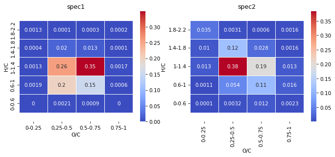
    

