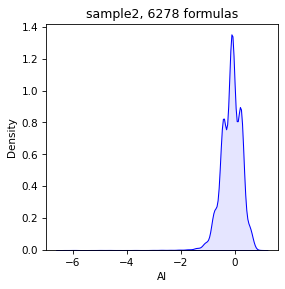

# Load Mass Spectrum and calculate metrics


```python
import natorgms.draw as draw
from natorgms.spectrum import Spectrum

import pandas as pd
import numpy as np
import matplotlib.pyplot as plt
```

## Load and save

Load mass spectrum from csv file. When loading, if the headings of m/z and intensity are not default ("mass", "intensity"), you must specify them by mapper. You also need to specify a separator (default is ","). In order not to load unnecessary data, we will also set the take_only_mz flag True. 


```python
spec = Spectrum.read_csv(filename = "data/sample2.csv",
                            mapper = {'m/z':'mass', "I":'intensity'},
                            take_only_mz = True,
                            sep = ',',
                            )
```

Now we can plot spectrum


```python
draw.spectrum(spec)
```


    

    


The next step is assignement of brutto formulas for the masses. By default, this process is performed on the following range of elements: 'C' from 4 to 50, 'H' from 4 to 100, 'O' from 0 to 25, 'N' from 0 to 3, 'S' from 0 to 2. The following rules are also followed by default: 0.25<H/C<2.2, O/C < 1, nitogen parity, DBE-O <= 10.

We can specify elements by brutto_dict parameters as bellow. If you want use isotopes use "_" and number, for example "C_13"

rel_error is allowable relative error. By default it is 0.5


```python
spec = spec.assign(brutto_dict={'C':(4,51), 'C_13':(0,3), 'H':(4,101), 'O':(0, 26), 'N':(0,3)}, rel_error=0.5)
```

Now you can see masses with brutto formulas. But first we can drop unassigned formulas


```python
spec = spec.drop_unassigned()
spec.table
```


<div>
<style scoped>
    .dataframe tbody tr th:only-of-type {
        vertical-align: middle;
    }

    .dataframe tbody tr th {
        vertical-align: top;
    }

    .dataframe thead th {
        text-align: right;
    }
</style>
<table border="1" class="dataframe">
  <thead>
    <tr style="text-align: right;">
      <th></th>
      <th>mass</th>
      <th>intensity</th>
      <th>assign</th>
      <th>C</th>
      <th>C_13</th>
      <th>H</th>
      <th>O</th>
      <th>N</th>
    </tr>
  </thead>
  <tbody>
    <tr>
      <th>0</th>
      <td>205.08706</td>
      <td>5072918</td>
      <td>True</td>
      <td>12.0</td>
      <td>0.0</td>
      <td>14.0</td>
      <td>3.0</td>
      <td>0.0</td>
    </tr>
    <tr>
      <th>1</th>
      <td>207.06445</td>
      <td>3388781</td>
      <td>True</td>
      <td>13.0</td>
      <td>1.0</td>
      <td>9.0</td>
      <td>1.0</td>
      <td>1.0</td>
    </tr>
    <tr>
      <th>2</th>
      <td>209.04557</td>
      <td>6721187</td>
      <td>True</td>
      <td>10.0</td>
      <td>0.0</td>
      <td>10.0</td>
      <td>5.0</td>
      <td>0.0</td>
    </tr>
    <tr>
      <th>3</th>
      <td>209.08202</td>
      <td>4015701</td>
      <td>True</td>
      <td>11.0</td>
      <td>0.0</td>
      <td>14.0</td>
      <td>4.0</td>
      <td>0.0</td>
    </tr>
    <tr>
      <th>4</th>
      <td>210.02769</td>
      <td>3463522</td>
      <td>True</td>
      <td>12.0</td>
      <td>1.0</td>
      <td>6.0</td>
      <td>3.0</td>
      <td>0.0</td>
    </tr>
    <tr>
      <th>...</th>
      <td>...</td>
      <td>...</td>
      <td>...</td>
      <td>...</td>
      <td>...</td>
      <td>...</td>
      <td>...</td>
      <td>...</td>
    </tr>
    <tr>
      <th>6273</th>
      <td>991.68139</td>
      <td>8570909</td>
      <td>True</td>
      <td>46.0</td>
      <td>2.0</td>
      <td>98.0</td>
      <td>18.0</td>
      <td>2.0</td>
    </tr>
    <tr>
      <th>6274</th>
      <td>993.51449</td>
      <td>10621638</td>
      <td>True</td>
      <td>41.0</td>
      <td>2.0</td>
      <td>80.0</td>
      <td>23.0</td>
      <td>2.0</td>
    </tr>
    <tr>
      <th>6275</th>
      <td>993.71227</td>
      <td>8240803</td>
      <td>True</td>
      <td>50.0</td>
      <td>2.0</td>
      <td>100.0</td>
      <td>15.0</td>
      <td>2.0</td>
    </tr>
    <tr>
      <th>6276</th>
      <td>995.67950</td>
      <td>9630054</td>
      <td>True</td>
      <td>50.0</td>
      <td>2.0</td>
      <td>98.0</td>
      <td>17.0</td>
      <td>0.0</td>
    </tr>
    <tr>
      <th>6277</th>
      <td>999.37335</td>
      <td>8356890</td>
      <td>True</td>
      <td>43.0</td>
      <td>2.0</td>
      <td>62.0</td>
      <td>23.0</td>
      <td>2.0</td>
    </tr>
  </tbody>
</table>
<p>6278 rows × 8 columns</p>
</div>


After assignment we can calculate different metrics: H/C, O/C, CRAM, NOSC, AI, DBE and other. We can do it separate by such methods as calc_ai, calc_dbe ... or do all by one command calc_all_metrics


```python
spec = spec.calc_all_metrics()
```

Now we can see all metrics


```python
spec.table.columns
```


    Index(['mass', 'intensity', 'assign', 'C', 'C_13', 'H', 'O', 'N', 'calc_mass',
           'abs_error', 'rel_error', 'DBE', 'DBE-O', 'DBE_AI', 'CAI', 'AI',
           'DBE-OC', 'H/C', 'O/C', 'class', 'CRAM', 'NOSC', 'brutto', 'Ke', 'KMD'],
          dtype='object')


You can save the data with spectrum and calculated metrics to a csv file at any time by to_csv method


```python
spec.to_csv('temp.csv')
```

## Draw

Data can be visualized by different methods

Simple Van-Krevelen diagramm. By default CHO formulas is blue, CHON is orange, CHOS is green, CHONS is red. There is no S, so it is only two colors here


```python
draw.vk(spec)
```


    

    


We can plot it with density axis


```python
draw.vk(spec, draw.scatter_density)
```


    

    


Or do it with any of metrics in spectrum. For example, NOSC vs DBE-OC


```python
draw.scatter(spec, x='NOSC', y='DBE-OC')
draw.scatter_density(spec, x='NOSC', y='DBE-OC')

```


    

    


    

    


We can plot separate density


```python
draw.density(spec, 'AI')
```


    

    


Or plot 2D kernel density scatter


```python
draw.density_2D(spec, x='NOSC', y='DBE-OC')
```


    

    


We can plot Kendric diagramm by command


```python
draw.scatter(spec, x='Ke', y='KMD')
```


    

    


## Molecular class

We can get average density of molecular classes of brutto formulas in spectrum


```python
spec.get_mol_class()
```


<div>
<style scoped>
    .dataframe tbody tr th:only-of-type {
        vertical-align: middle;
    }

    .dataframe tbody tr th {
        vertical-align: top;
    }

    .dataframe thead th {
        text-align: right;
    }
</style>
<table border="1" class="dataframe">
  <thead>
    <tr style="text-align: right;">
      <th></th>
      <th>class</th>
      <th>density</th>
    </tr>
  </thead>
  <tbody>
    <tr>
      <th>0</th>
      <td>unsat_lowOC</td>
      <td>0.553290</td>
    </tr>
    <tr>
      <th>1</th>
      <td>unsat_highOC</td>
      <td>0.404771</td>
    </tr>
    <tr>
      <th>2</th>
      <td>condensed_lowOC</td>
      <td>0.000409</td>
    </tr>
    <tr>
      <th>3</th>
      <td>condensed_highOC</td>
      <td>0.000278</td>
    </tr>
    <tr>
      <th>4</th>
      <td>aromatic_lowOC</td>
      <td>0.010322</td>
    </tr>
    <tr>
      <th>5</th>
      <td>aromatic_highOC</td>
      <td>0.000261</td>
    </tr>
    <tr>
      <th>6</th>
      <td>aliphatics</td>
      <td>0.008320</td>
    </tr>
    <tr>
      <th>7</th>
      <td>lipids</td>
      <td>0.003229</td>
    </tr>
    <tr>
      <th>8</th>
      <td>N-satureted</td>
      <td>0.009970</td>
    </tr>
    <tr>
      <th>9</th>
      <td>undefinded</td>
      <td>0.009150</td>
    </tr>
  </tbody>
</table>
</div>


## Metrics

We can get any metrics that avarage by weight of intensity.


```python
spec.get_mol_metrics()
```


<div>
<style scoped>
    .dataframe tbody tr th:only-of-type {
        vertical-align: middle;
    }

    .dataframe tbody tr th {
        vertical-align: top;
    }

    .dataframe thead th {
        text-align: right;
    }
</style>
<table border="1" class="dataframe">
  <thead>
    <tr style="text-align: right;">
      <th></th>
      <th>metric</th>
      <th>value</th>
    </tr>
  </thead>
  <tbody>
    <tr>
      <th>0</th>
      <td>AI</td>
      <td>-0.016670</td>
    </tr>
    <tr>
      <th>1</th>
      <td>C</td>
      <td>24.216486</td>
    </tr>
    <tr>
      <th>2</th>
      <td>CAI</td>
      <td>12.502903</td>
    </tr>
    <tr>
      <th>3</th>
      <td>CRAM</td>
      <td>0.798058</td>
    </tr>
    <tr>
      <th>4</th>
      <td>C_13</td>
      <td>0.231241</td>
    </tr>
    <tr>
      <th>5</th>
      <td>DBE</td>
      <td>12.569666</td>
    </tr>
    <tr>
      <th>6</th>
      <td>DBE-O</td>
      <td>0.742390</td>
    </tr>
    <tr>
      <th>7</th>
      <td>DBE-OC</td>
      <td>0.027562</td>
    </tr>
    <tr>
      <th>8</th>
      <td>DBE_AI</td>
      <td>0.624843</td>
    </tr>
    <tr>
      <th>9</th>
      <td>H</td>
      <td>25.873668</td>
    </tr>
    <tr>
      <th>10</th>
      <td>H/C</td>
      <td>1.057624</td>
    </tr>
    <tr>
      <th>11</th>
      <td>N</td>
      <td>0.117547</td>
    </tr>
    <tr>
      <th>12</th>
      <td>NOSC</td>
      <td>-0.064638</td>
    </tr>
    <tr>
      <th>13</th>
      <td>O</td>
      <td>11.827276</td>
    </tr>
    <tr>
      <th>14</th>
      <td>O/C</td>
      <td>0.489112</td>
    </tr>
    <tr>
      <th>15</th>
      <td>mass</td>
      <td>509.495873</td>
    </tr>
  </tbody>
</table>
</div>


```python
spec.get_mol_metrics(metrics=['AI', 'DBE', 'NOSC', 'H/C', 'O/C'])
```


<div>
<style scoped>
    .dataframe tbody tr th:only-of-type {
        vertical-align: middle;
    }

    .dataframe tbody tr th {
        vertical-align: top;
    }

    .dataframe thead th {
        text-align: right;
    }
</style>
<table border="1" class="dataframe">
  <thead>
    <tr style="text-align: right;">
      <th></th>
      <th>metric</th>
      <th>value</th>
    </tr>
  </thead>
  <tbody>
    <tr>
      <th>0</th>
      <td>AI</td>
      <td>-0.016670</td>
    </tr>
    <tr>
      <th>1</th>
      <td>DBE</td>
      <td>12.569666</td>
    </tr>
    <tr>
      <th>2</th>
      <td>H/C</td>
      <td>1.057624</td>
    </tr>
    <tr>
      <th>3</th>
      <td>NOSC</td>
      <td>-0.064638</td>
    </tr>
    <tr>
      <th>4</th>
      <td>O/C</td>
      <td>0.489112</td>
    </tr>
  </tbody>
</table>
</div>


We can avarage the same by mean or other function(max, min, std, median)


```python
spec.get_mol_metrics(metrics=['AI', 'DBE', 'NOSC', 'H/C', 'O/C'], func='mean')
```


<div>
<style scoped>
    .dataframe tbody tr th:only-of-type {
        vertical-align: middle;
    }

    .dataframe tbody tr th {
        vertical-align: top;
    }

    .dataframe thead th {
        text-align: right;
    }
</style>
<table border="1" class="dataframe">
  <thead>
    <tr style="text-align: right;">
      <th></th>
      <th>metric</th>
      <th>value</th>
    </tr>
  </thead>
  <tbody>
    <tr>
      <th>0</th>
      <td>AI</td>
      <td>-0.099484</td>
    </tr>
    <tr>
      <th>1</th>
      <td>DBE</td>
      <td>12.824626</td>
    </tr>
    <tr>
      <th>2</th>
      <td>H/C</td>
      <td>1.088260</td>
    </tr>
    <tr>
      <th>3</th>
      <td>NOSC</td>
      <td>-0.117060</td>
    </tr>
    <tr>
      <th>4</th>
      <td>O/C</td>
      <td>0.462034</td>
    </tr>
  </tbody>
</table>
</div>


Also we can split VanKrevelen diagramm to squares and calculate density in each squares


```python
spec.get_squares_vk(draw=True)
```


<div>
<style scoped>
    .dataframe tbody tr th:only-of-type {
        vertical-align: middle;
    }

    .dataframe tbody tr th {
        vertical-align: top;
    }

    .dataframe thead th {
        text-align: right;
    }
</style>
<table border="1" class="dataframe">
  <thead>
    <tr style="text-align: right;">
      <th></th>
      <th>value</th>
      <th>square</th>
    </tr>
  </thead>
  <tbody>
    <tr>
      <th>0</th>
      <td>0.000059</td>
      <td>1</td>
    </tr>
    <tr>
      <th>1</th>
      <td>0.001766</td>
      <td>2</td>
    </tr>
    <tr>
      <th>2</th>
      <td>0.002253</td>
      <td>3</td>
    </tr>
    <tr>
      <th>3</th>
      <td>0.003180</td>
      <td>4</td>
    </tr>
    <tr>
      <th>4</th>
      <td>0.003691</td>
      <td>5</td>
    </tr>
    <tr>
      <th>5</th>
      <td>0.001909</td>
      <td>6</td>
    </tr>
    <tr>
      <th>6</th>
      <td>0.207173</td>
      <td>7</td>
    </tr>
    <tr>
      <th>7</th>
      <td>0.257413</td>
      <td>8</td>
    </tr>
    <tr>
      <th>8</th>
      <td>0.019422</td>
      <td>9</td>
    </tr>
    <tr>
      <th>9</th>
      <td>0.002741</td>
      <td>10</td>
    </tr>
    <tr>
      <th>10</th>
      <td>0.001424</td>
      <td>11</td>
    </tr>
    <tr>
      <th>11</th>
      <td>0.144290</td>
      <td>12</td>
    </tr>
    <tr>
      <th>12</th>
      <td>0.333394</td>
      <td>13</td>
    </tr>
    <tr>
      <th>13</th>
      <td>0.012810</td>
      <td>14</td>
    </tr>
    <tr>
      <th>14</th>
      <td>0.001791</td>
      <td>15</td>
    </tr>
    <tr>
      <th>15</th>
      <td>0.000304</td>
      <td>16</td>
    </tr>
    <tr>
      <th>16</th>
      <td>0.001035</td>
      <td>17</td>
    </tr>
    <tr>
      <th>17</th>
      <td>0.003152</td>
      <td>18</td>
    </tr>
    <tr>
      <th>18</th>
      <td>0.001605</td>
      <td>19</td>
    </tr>
    <tr>
      <th>19</th>
      <td>0.000586</td>
      <td>20</td>
    </tr>
  </tbody>
</table>
</div>


    

    


It may also be useful to calculate the dependence od DBE vs nO. By fit the slope we can determinen state of sample


```python
spec.get_dbe_vs_o(draw=True, olim=(5, 18))
```


    (0.5649594882493085, 6.118940572968191)


    

    


Using the obtained metrics, it is possible to classify samples by origin or property, train different models.
