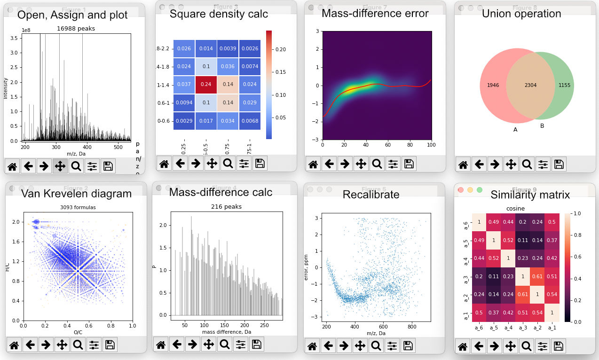

.. natorgms documentation master file, created by
   sphinx-quickstart on Thu Aug 11 18:33:15 2022.
   You can adapt this file completely to your liking, but it should at least
   contain the root `toctree` directive.

Welcome to natorgms's documentation!
====================================

natorgms is an open source Python package for processing high resolution mass spectra, priviosly for analysis dissolve organic matter, humic samples and other difficult object by FTICR or Orbitrap technique. 

Main operation:

- Assigning brutto formulas to signal by mass with desirable ranges of elements (include isotopes)
- Recallibrate spectrum by etalon, asssigment error or dif-mass map
- Working with spectra as with sets (intersection, union, etc)
- Plot spectrum and different kind of Van Krevelen diagramm
- Calculate simmilarity metrics and moleculars descriptors for spectra

.. toctree::
   :maxdepth: 1
   :caption: Contents:
   
   Install <install.md>
   Examples <examples.rst>
   API <api/natorgms.rst>
   GUI Tutorial <gui_tutorial.md>