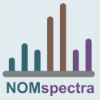
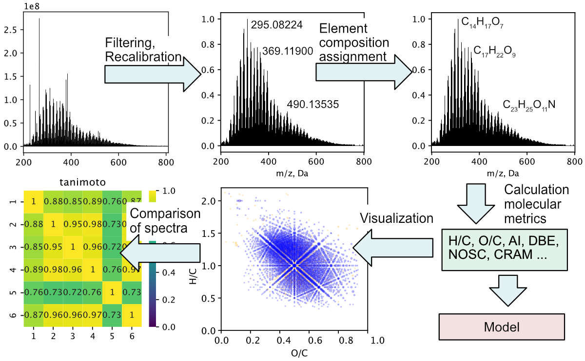

.. nomspectra documentation master file, created by
   sphinx-quickstart on Thu Aug 11 18:33:15 2022.
   You can adapt this file completely to your liking, but it should at least
   contain the root `toctree` directive.

nomspectra documentation
====================================

nomspectra is an open-source Python package for processing high resolution mass spectra. The name is an acronym for Natural Organic matter Mass Spectrometry, so package designed for analysis natural organic matter (NOM) which are represent such substances as dissolve organic matter (DOM), humic substances, lignin, biochar and other objects of oxidative destruction of natural compounds which are characterized by thousands of signals in the spectrum and require special methods for analysis. The package implements a full-fledged workflow for processing, analysis and visualization of mass spectrum. Various algorithms for filtering spectra, recalibrating and assignment of elemental composition to ions are presented. The package implements methods for calculating different molecular descriptors and methods for data visualization. A graphical user interface (GUI) for package has been implemented, which makes this package convenient for a wide range of users.

Main operation:

- Assigning elemental composition to signal by mass with desirable ranges of elements (include isotopes)
- Fine recalibrate spectrum by standard, assignment error or dif-mass map
- Working with spectra as with sets (intersection, union, etc.)
- Plot spectrum and different kind of Scatter and density diagram such as Van Krevelen diagram
- Calculate similarity metrics between spectra
- Calculate molecular descriptors (DBE, AI, NOSC, CRAM and other) for spectra

.. toctree::
   :maxdepth: 1
   :caption: Contents:
   
   Install <install.md>
   Examples <examples.rst>
   API <api/nomspectra.rst>
   GUI Tutorial <gui_tutorial.md>
